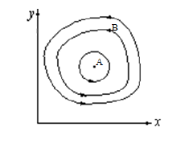
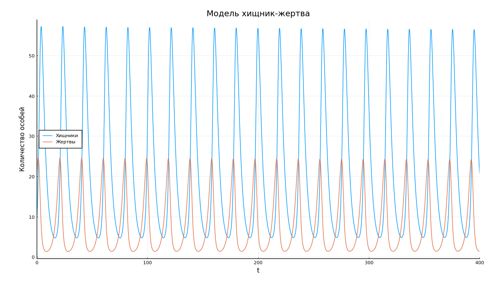

---
# Front matter
lang: ru-RU
title: "Отчет по лабораторной работе № 5. Модель хищник-жертва"
subtitle: "дисциплина: Математическое моделирование"
author: "Наливайко Сергей Максимович"

# Formatting
toc-title: "Содержание"
toc: true # Table of contents
toc_depth: 2
lof: false # List of figures
lot: false # List of tables
fontsize: 12pt
linestretch: 1.5
papersize: a4paper
documentclass: scrreprt
polyglossia-lang: russian
polyglossia-otherlangs: english
mainfont: PT Serif
romanfont: PT Serif
sansfont: PT Sans
monofont: PT Mono
mainfontoptions: Ligatures=TeX
romanfontoptions: Ligatures=TeX
sansfontoptions: Ligatures=TeX,Scale=MatchLowercase
monofontoptions: Scale=MatchLowercase
indent: true
pdf-engine: lualatex
header-includes:
  - \linepenalty=10 # the penalty added to the badness of each line within a paragraph (no associated penalty node) Increasing the value makes tex try to have fewer lines in the paragraph.
  - \interlinepenalty=0 # value of the penalty (node) added after each line of a paragraph.
  - \hyphenpenalty=50 # the penalty for line breaking at an automatically inserted hyphen
  - \exhyphenpenalty=50 # the penalty for line breaking at an explicit hyphen
  - \binoppenalty=700 # the penalty for breaking a line at a binary operator
  - \relpenalty=500 # the penalty for breaking a line at a relation
  - \clubpenalty=150 # extra penalty for breaking after first line of a paragraph
  - \widowpenalty=150 # extra penalty for breaking before last line of a paragraph
  - \displaywidowpenalty=50 # extra penalty for breaking before last line before a display math
  - \brokenpenalty=100 # extra penalty for page breaking after a hyphenated line
  - \predisplaypenalty=10000 # penalty for breaking before a display
  - \postdisplaypenalty=0 # penalty for breaking after a display
  - \floatingpenalty = 20000 # penalty for splitting an insertion (can only be split footnote in standard LaTeX)
  - \raggedbottom # or \flushbottom
  - \usepackage{float} # keep figures where there are in the text
  - \floatplacement{figure}{H} # keep figures where there are in the text
---

# Цель работы

Научиться моделировать простейшую модель взаимодействия двух видов типа «хищник — жертва» - модель Лотки-Вольтерры.

# Выполнение лабораторной работы

## Краткая теоретическая справка

Двувидовая модель Лотки-Вольтерры основывается на следующих предположениях:

1. Численность популяции жертв x и хищников y зависят только от времени (модель не учитывает пространственное распределение популяции на занимаемой территории);
2. В отсутствии взаимодействия численность видов изменяется по модели Мальтуса, при этом число жертв увеличивается, а число хищников падает;
3. Естественная смертность жертвы и естественная рождаемость хищника считаются несущественными;
4. Эффект насыщения численности обеих популяций не учитывается;
5.  Скорость роста численности жертв уменьшается пропорционально численности хищников;

$$
\frac{\partial{x}}{\partial{t}} = ax(t) - bx(t)y(t)
$$

$$
\frac{\partial{y}}{\partial{t}} = -cy(t) + bx(t)y(t)
$$

В этой модели $x$ – число жертв, $y$ - число хищников. Коэффициент a описывает скорость естественного прироста числа жертв в отсутствие хищников, $c$ - естественное вымирание хищников, лишенных пищи в виде жертв. Вероятность взаимодействия жертвы и хищника считается пропорциональной как количеству жертв, так и числу самих хищников (xy). Каждый акт взаимодействия уменьшает популяцию жертв, но способствует увеличению популяции хищников (члены $-bxy$ и $dxy$ в правой части уравнения). 

Математический анализ этой (жесткой) модели показывает, что имеется стационарное состояние (A на рис. -@fig:001) всякое же другое начальное состояние (B) приводит к периодическому колебанию численности как жертв, так и хищников, так что по прошествии некоторого времени система возвращается в состояние B. 

{ #fig:001 width=70% }

Стационарное состояние системы (положение равновесия, не зависящее от времени решение) будет в точке: $x_0 = \frac{c}{d}, y_0 = \frac{a}{b}$. Если начальные значения задать в стационарном состоянии $x(0) = x_0, y(0) = y_0$, то в любой момент времени численность популяций изменяться не будет. При малом отклонении от положения равновесия численности как хищника, так и жертвы с течением времени не возвращаются к равновесным значениям, а совершают периодические колебания вокруг стационарной точки. Амплитуда колебаний и их период определяется начальными значениями численностей $x(0), y(0)$. Колебания совершаются в противофазе.


## Формулировка задачи. Вариант 45

Для модели «хищник-жертва»:

  $$
      \begin{cases} 
      \frac{\partial{x}}{\partial{t}} = -0.32y(t) + 0.04x(t)y(t) \\ 
      \frac{\partial{y}}{\partial{t}} = 0.42y(t) - 0.02x(t)y(t) \\ 
      \end{cases}
  $$

Постройте график зависимости численности хищников от численности жертв, а также графики изменения численности хищников и численности жертв при следующих начальных условиях: $x_0 = 9, y_0 = 20$. Найдите стационарное
состояние системы.

## Решение задачи

Напишем программный код и посмотрим на вывод программы. 

```
using Plots 
using DifferentialEquations
pyplot();
a = 0.32;
b = 0.04;
c = 0.42;
d = 0.02;

t = (0.0, 400.0);
step = 0.01;
p = [a,b,c,d];
x0 = [9,20];

function syst(dx,x,p,t)
    a,b,c,d = p;
    dx[1] = -a*x[1] + b*x[1] * x[2];
    dx[2] =  c*x[2] - d*x[1] * x[2];
end

prob = ODEProblem(syst, x0, t, p);
sol = solve(prob, saveat = step);

n = length(sol);
y1 = zeros(n);
y2 = zeros(n);

for i in 1:n
    y1[i] = sol.u[i][1];
    y2[i] = sol.u[i][2];
end

plot(y1,y2, xlabel = "Хищники", ylabel = "Жертвы", label = "График изменения количества жертв от количества хищников")
scatter!([c/d], [a/b], label = "Стац точка")
title!("Модель хищник-жертва")
```

При запуске программы мы получим зависимости изменения численности хищников от изменения численности жертв (рис. -@fig:002).

{ #fig:002 width=70% }

Закроем график и выполним команды

```
plot(sol, xlabel = "t", ylabel = "Количество особей", label = ["Хищники" "Жертвы"])
title!("Модель хищник-жертва")
```

Получим графики изменения численности хищников и численности жертв (рис. -@fig:003)

{ #fig:003 width=70% }

# Вывод

В ходе лабораторной работы мы научились моделировать простейшую модель взаимодействия двух видов типа «хищник — жертва».