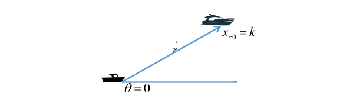
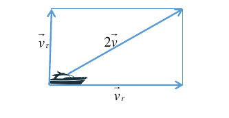
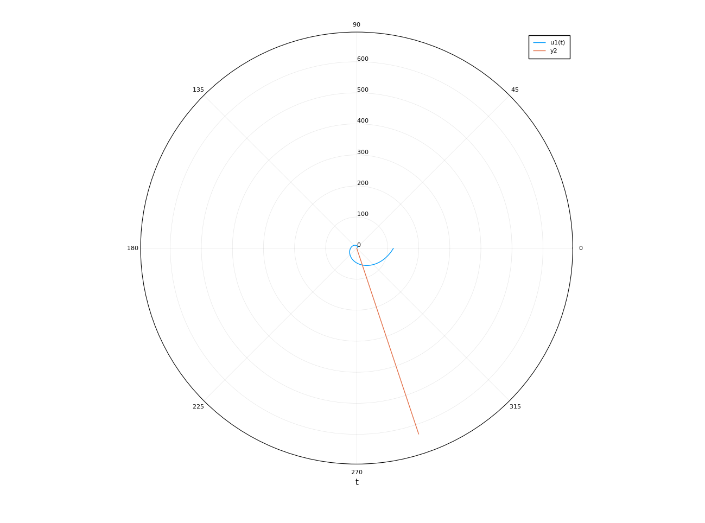
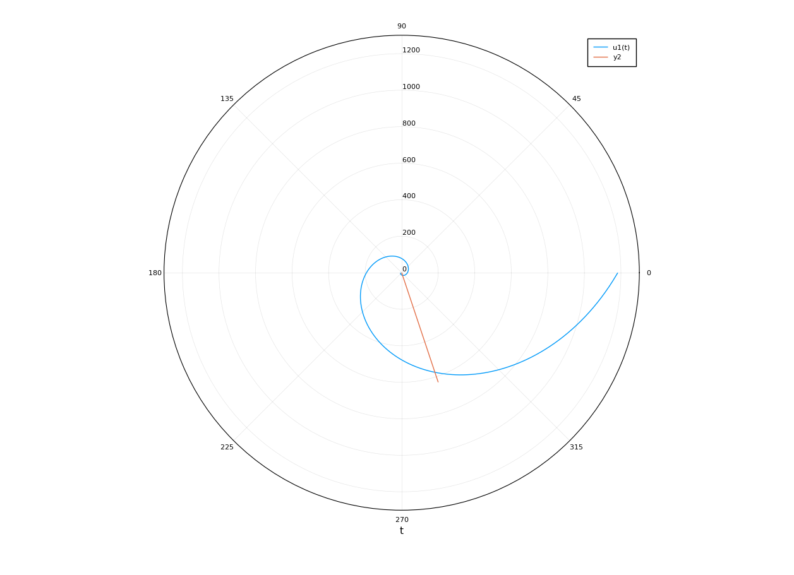

---
# Front matter
lang: ru-RU
title: "Отчет по лабораторной работе № 2"
subtitle: "дисциплина: Математическое моделирование"
author: "Наливайко Сергей Максимович"

# Formatting
toc-title: "Содержание"
toc: true # Table of contents
toc_depth: 2
lof: false # List of figures
lot: false # List of tables
fontsize: 12pt
linestretch: 1.5
papersize: a4paper
documentclass: scrreprt
polyglossia-lang: russian
polyglossia-otherlangs: english
mainfont: PT Serif
romanfont: PT Serif
sansfont: PT Sans
monofont: PT Mono
mainfontoptions: Ligatures=TeX
romanfontoptions: Ligatures=TeX
sansfontoptions: Ligatures=TeX,Scale=MatchLowercase
monofontoptions: Scale=MatchLowercase
indent: true
pdf-engine: lualatex
header-includes:
  - \linepenalty=10 # the penalty added to the badness of each line within a paragraph (no associated penalty node) Increasing the value makes tex try to have fewer lines in the paragraph.
  - \interlinepenalty=0 # value of the penalty (node) added after each line of a paragraph.
  - \hyphenpenalty=50 # the penalty for line breaking at an automatically inserted hyphen
  - \exhyphenpenalty=50 # the penalty for line breaking at an explicit hyphen
  - \binoppenalty=700 # the penalty for breaking a line at a binary operator
  - \relpenalty=500 # the penalty for breaking a line at a relation
  - \clubpenalty=150 # extra penalty for breaking after first line of a paragraph
  - \widowpenalty=150 # extra penalty for breaking before last line of a paragraph
  - \displaywidowpenalty=50 # extra penalty for breaking before last line before a display math
  - \brokenpenalty=100 # extra penalty for page breaking after a hyphenated line
  - \predisplaypenalty=10000 # penalty for breaking before a display
  - \postdisplaypenalty=0 # penalty for breaking after a display
  - \floatingpenalty = 20000 # penalty for splitting an insertion (can only be split footnote in standard LaTeX)
  - \raggedbottom # or \flushbottom
  - \usepackage{float} # keep figures where there are in the text
  - \floatplacement{figure}{H} # keep figures where there are in the text
---

# Цель работы

Рассмотреть тип задач о погоне, получить практические навыки работы с Julia.

# Выполнение лабораторной работы

## Формулировка задачи

### Задача о погоне

Рассмотрим задачу преследования браконьеров береговой охраной. На море в тумане катер береговой охраны преследует лодку браконьеров. Через определенный промежуток времени туман рассеивается, и лодка обнаруживается на расстоянии 16.4 км от катера. Затем лодка снова скрывается в тумане и уходит прямолинейно в неизвестном направлении. Известно, что скорость катера в 4.2 раза больше скорости браконьерской лодки. 

Необходимо определить по какой траектории необходимо двигаться катеру, чтоб нагнать лодку.

## Решение задачи

1. Пусть, $t_0$, $x_{l0}$ -  место нахождения лодки браконьеров в момент обнаружения, $x_{k0} = k$ - место нахождения катера береговой охраны относительно лодки браконьеров в момент обнаружения лодки.
2. Введем полярные координаты. Полюс - точка обнаружения лодки браконьеров $x_{l0}$ ($\theta = x_{l0} = 0$), а полярная ось $r$ проходит через точку нахождения катера береговой охраны (рис. -@fig:001)

  { #fig:001 width=70% }

3. Траектория катера должна быть такой, чтобы и катер и лодка были равноудалены от $\theta$. Поэтому, катер должен двигаться некоторое время прямолинейно, пока и катер и лодка не окажутся на одном расстоянии от $\theta$. После этого катер должен двигаться вокруг полюса, чтобы в какой-то момент времени настигнуть лодку. 
4. Вычислим значение времени, которое катер должен двигаться прямолинейно. Это значение $t_1$ катера, очевидно, равно значению $t_2$ лодки. Пусть, x - путь, который пройдет за это время лодка, тогда

  $$
  \frac{x}{v} = \frac{k - x}{nv} \Rightarrow xn = k - x \Rightarrow x = \frac{k}{n + 1} 
  $$

  или

  $$
  \frac{x}{v} = \frac{k + x}{nv} \Rightarrow xn = k + x \Rightarrow x = \frac{k}{n -1}, 
  $$

  в зависимости от начального положения катера относительно полюса. В нашем случае: 

  $$
  x_1 = \frac{16.4}{5.2}, x_2 = \frac{16.4}{3.2}.
  $$

5. Мы знаем, что лодка движется прямолинейно. Значит, после того, как и лодка и катер окажутся на одном расстоянии от $\theta$, катер должен двигаться от $\theta$ со скоростью, равной скорости лодки, и с линейной скоростью вращения относительно полюса. То есть, разложим вектор $\overrightarrow{v_{k}}$ на 2 составляющие: радиальную (скорость, с которой катер удаляется от полюса) и тангенциальную(скорость, с которой катер линейно вращается вокруг полюса). Соответственно:

  $$
  v_r = \frac{dr}{dt}, v_{\tau} = r * \frac{d\theta}{dt}.
  $$

  Так как $v_r$ = $v_{l}$, то $\frac{dr}{dt} = v_{l}$.

  Из рисунка видно (рис. -@fig:002), что $v_{\tau} = \sqrt{4v^2 - v^2} = \sqrt{3}v$. 

  { #fig:002 width=70% }

6. Решение задачи сводится к решению системы:

  $$
    \begin{cases} 
    \frac{dr}{dt} = v \\ 
    \frac{d\theta}{dt} * r  = \sqrt{3}v \\ 
    \end{cases}
  $$

  С начальными условиями $\begin{cases} \theta_0 = 0 \\ r_0 = 5.2  \end{cases}$ и $\begin{cases} \theta_1 = -\pi \\ r_1 = 3.2  \end{cases}$. 

  Исключая из системы производную по t получим:

  $$
  \frac{dr}{d\theta} = \frac{r}{\sqrt{3}}.
  $$
  
7. Напишем программный код для первого случая и получим график (рис. -@fig:003).
   
   Код:

   ```Julia

  using Plots
  using DifferentialEquations
  Plots.pyplot()
  s=16.4;
  r0 = s/(3.2);
  tetha0 = 0; 

  f1(r, p, tetha) = r/sqrt(3);
  f2(t) = atan(-3);
  f3(t) = sqrt(10)*t;

  tetha = (tetha0,2*pi);
  prob = ODEProblem(f1, r0, tetha);
  sol = solve(prob);

  t=range(0,100, step=1);
  fi = f2.(t);
  ro = f3.(t);

  plot(sol, proj=:polar)
  plot!(fi, ro)

   ```

  { #fig:003 width=70% }

8. Напишем программный код для второго случая и получим график (рис. -@fig:004).

  Код:

  ```Julia

  using Plots
  using DifferentialEquations
  Plots.pyplot()
  s=16.4;
  r0 = s/(5.2); 
  tetha0 = -pi; ## 2th case 

  f1(r, p, tetha) = r/sqrt(3);
  f2(t) = atan(-3);
  f3(t) = sqrt(10)*t;

  tetha = (tetha0, pi);
  prob = ODEProblem(f1, r0, tetha);
  sol = solve(prob);

  t=range(0,100, step=1);
  fi = f2.(t);
  ro = f3.(t);

  plot(sol, proj=:polar)
  plot!(fi, ro)

  ```

  { #fig:004 width=70% }

# Выводы

В ходе лабораторной работы мы рассмотреть тип задач о погоне, получили практические навыки работы с Julia.
