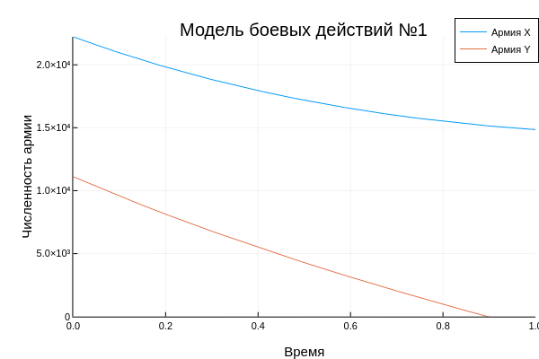
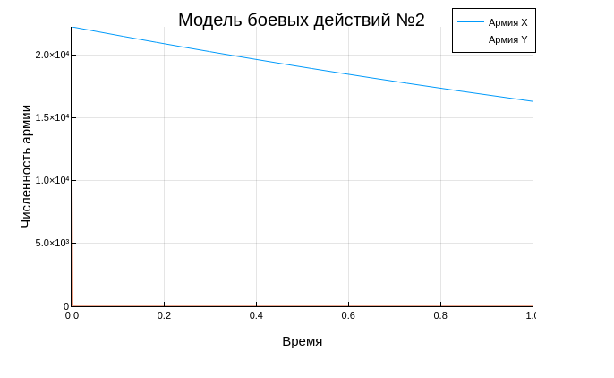
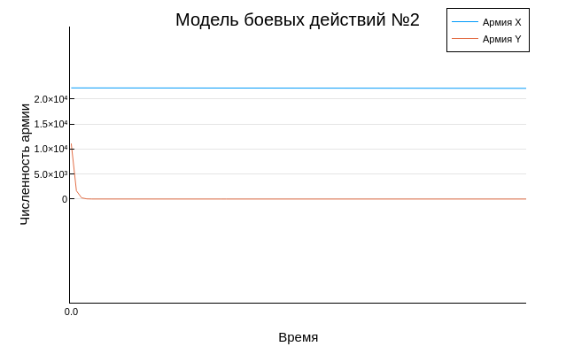

---
# Front matter
lang: ru-RU
title: "Отчет по лабораторной работе № 3. Модель боевых действий"
subtitle: "дисциплина: Математическое моделирование"
author: "Наливайко Сергей Максимович"

# Formatting
toc-title: "Содержание"
toc: true # Table of contents
toc_depth: 2
lof: false # List of figures
lot: false # List of tables
fontsize: 12pt
linestretch: 1.5
papersize: a4paper
documentclass: scrreprt
polyglossia-lang: russian
polyglossia-otherlangs: english
mainfont: PT Serif
romanfont: PT Serif
sansfont: PT Sans
monofont: PT Mono
mainfontoptions: Ligatures=TeX
romanfontoptions: Ligatures=TeX
sansfontoptions: Ligatures=TeX,Scale=MatchLowercase
monofontoptions: Scale=MatchLowercase
indent: true
pdf-engine: lualatex
header-includes:
  - \linepenalty=10 # the penalty added to the badness of each line within a paragraph (no associated penalty node) Increasing the value makes tex try to have fewer lines in the paragraph.
  - \interlinepenalty=0 # value of the penalty (node) added after each line of a paragraph.
  - \hyphenpenalty=50 # the penalty for line breaking at an automatically inserted hyphen
  - \exhyphenpenalty=50 # the penalty for line breaking at an explicit hyphen
  - \binoppenalty=700 # the penalty for breaking a line at a binary operator
  - \relpenalty=500 # the penalty for breaking a line at a relation
  - \clubpenalty=150 # extra penalty for breaking after first line of a paragraph
  - \widowpenalty=150 # extra penalty for breaking before last line of a paragraph
  - \displaywidowpenalty=50 # extra penalty for breaking before last line before a display math
  - \brokenpenalty=100 # extra penalty for page breaking after a hyphenated line
  - \predisplaypenalty=10000 # penalty for breaking before a display
  - \postdisplaypenalty=0 # penalty for breaking after a display
  - \floatingpenalty = 20000 # penalty for splitting an insertion (can only be split footnote in standard LaTeX)
  - \raggedbottom # or \flushbottom
  - \usepackage{float} # keep figures where there are in the text
  - \floatplacement{figure}{H} # keep figures where there are in the text
---

# Цель работы

Научиться моделировать простейшую модель боевых действий (модель Ланчестера).

# Выполнение лабораторной работы

## Краткая теоретическая справка

В противоборстве могут принимать участие как регулярные войска, так и партизанские отряды. В общем случае главной характеристикой соперников являются численности сторон. Если в какой-то момент времени одна из численностей обращается в нуль, то данная сторона считается проигравшей (при условии, что численность другой стороны в данный момент положительна).

Существует три случая ведения боевых действий:

1. Боевые действия между регулярными войсками. Данная модель описывается таким дифференциальным уравнением: 
  $$ \frac{dx}{dt} = - a(t)x(t) - b(t)y(t) + P(t) $$ 
  $$ \frac{dy}{dt} = - c(t)x(t) - h(t)y(t) + Q(t) $$

2. Боевые действия с участием регулярных войск и партизанских отрядов. Данная модель описывается таким дифференциальным уравнением: 
  $$ \frac{dx}{dt} = - a(t)x(t) - b(t)y(t) + P(t) $$ 
  $$ \frac{dy}{dt} = - c(t)x(t)y(t) - h(t)y(t) + Q(t) $$

3. Боевые действия между партизанскими отрядами. Данная модель описывается таким дифференциальным уравнением: 
  $$ \frac{dx}{dt} = - a(t)x(t) - b(t)x(t)y(t) + P(t) $$ 
  $$ \frac{dy}{dt} = - h(t)y(t) - c(t)x(t)y(t) + Q(t) $$

В каждой из моделей имеет место: члены $a$ и $h$ - коэффициенты потерь, которые не связаны с боевыми действиями, $b$ и $c$ - коэффициенты потерь на поле боя, $P(t)$ и $Q(t)$ - функции, которые учитывают возможности подхода подкрепления к войскам Х и У в течение одного дня. 

## Формулировка задачи. Вариант 45

Между страной Х и страной У идет война. Численность состава войск исчисляется от начала войны, и являются временными функциями x(t) и y(t). В начальный момент времени страна Х имеет армию численностью 22 222 человек, а в распоряжении страны Y армия численностью в 11 111 человек. Для упрощения модели считаем, что коэффициенты a, b, c, h постоянны. Также считаем P(t) и Q(t) непрерывные функции.

Постройте графики изменения численности войск армии Х и армии У для следующих случаев:

1. Модель боевых действий между регулярными войсками
  $$ \frac{dx}{dt} = - 0.22 * x(t) - 0.77 * y(t) + \sin{0.5t} + 1 $$ 
  $$ \frac{dy}{dt} = - 0.66 * x(t) - 0.11 * y(t) + \cos{0.5t} + 2 $$

2. Модель ведение боевых действий с участием регулярных войск и партизанских отрядов
  $$ \frac{dx}{dt} = - 0.31 * x(t) - 0.79 * y(t) + \sin{2.5t} + 1 $$ 
  $$ \frac{dy}{dt} = - 0.59 * x(t) * y(t) - 0.21 * y(t) + \cos{2t} + 2 $$

## Решение задачи

Из формулировки задания нам становятся известны все параметры системы: a, b, c, h, P(t), Q(t), x0, y0.

1. Составим программный код для 1го случая:

  ```Julia
  using Plots
  using DifferentialEquations
  plotlyjs()

  x0 = 22222;
  y0 = 11111;

  a = 0.22;
  b = 0.77;
  c = 0.66;
  h = 0.11;

  tmax = 1;

  t = (0,tmax);

  P(t) = sin(0.5 * t) + 2;
  Q(t) = cos(0.5 * t) + 2;


  function syst(du, u, p, t)
      a, b, c, h = p;
      du[1] = -a * u[1] - b * u[2] + P(t);
      du[2] = -c * u[1] - h * u[2] + Q(t);
  end

  u0 = [x0, y0];
  p = (a,b,c,h);

  prob = ODEProblem(syst, u0, t, p);
  sol = solve(prob);
  plot(sol, ylims=(0, 22222), xlabel = "Время", ylabel = "Численность армии", label = ["Армия X" "Армия Y"])
  title!("Модель боевых действий №1")
  ```

  Получим график изменения численности войск армии X и армии Y от времени (рис. -@fig:001).

  { #fig:001 width=70% }

2. Составим программный код для 2го случая:

  ```Julia
  using Plots
  using DifferentialEquations
  plotlyjs()

  x0 = 22222;
  y0 = 11111;

  a = 0.31;
  b = 0.79;
  c = 0.59;
  h = 0.21;

  tmax = 1;

  t = (0,tmax);

  P(t) = sin(2.5 * t) + 1;
  Q(t) = cos(2 * t) + 2;


  function syst(du, u, p, t)
      a, b, c, h = p;
      du[1] = -a * u[1] - b * u[2] + P(t);
      du[2] = -c * u[1] * u[2] - h * u[2] + Q(t);
  end

  u0 = [x0, y0];
  p = (a,b,c,h);

  prob = ODEProblem(syst, u0, t, p);
  sol = solve(prob);
  plot(sol, ylims=(0, 22222), xlabel = "Время", ylabel = "Численность армии", label = ["Армия X" "Армия Y"])
  title!("Модель боевых действий №2")
  ```

  Получим график изменения численности войск армии X и армии Y от времени (рис. -@fig:002, рис. -@fig:003).

  { #fig:002 width=70% }

  { #fig:003 width=70% }


# Вывод

В ходе лабораторной работы мы научились моделировать простейшую модель боевых действий (модель Ланчестера).