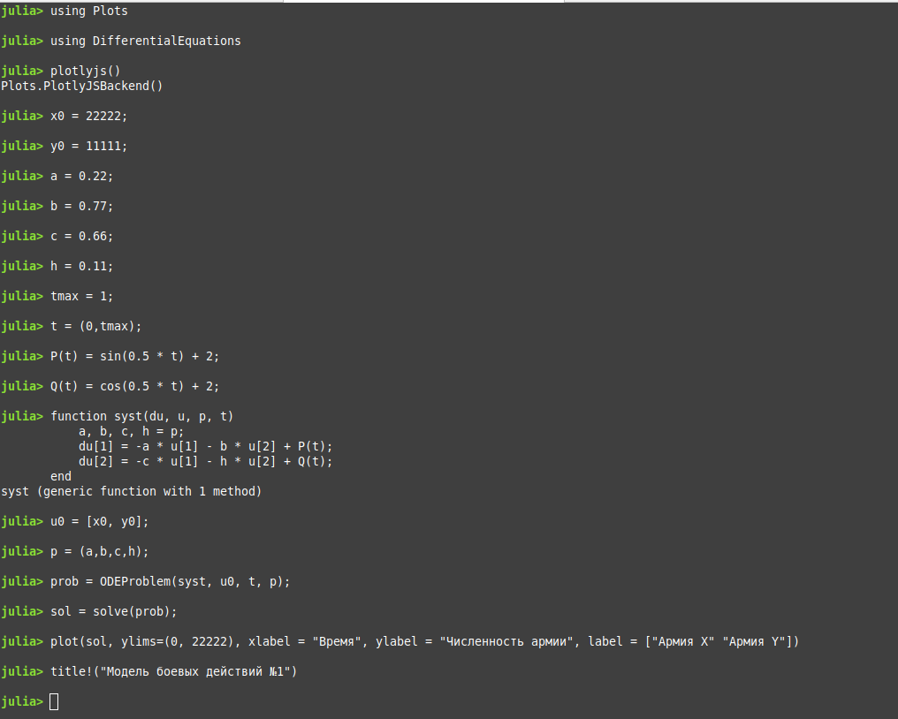
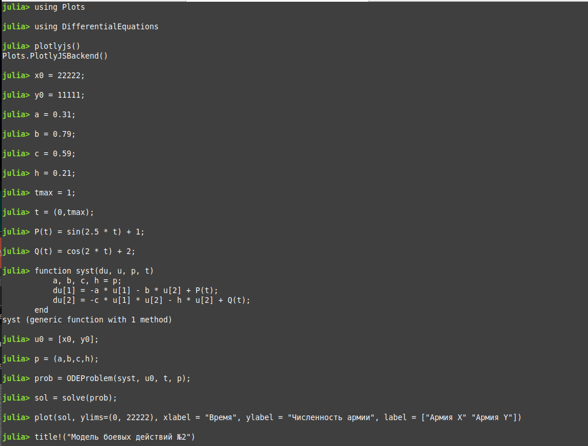

---
## Front matter
lang: ru-RU
title: Защита лабораторной работы № 3. Модель боевых действий
author: Наливайко Сергей Максимович
institute: RUDN University, Moscow, Russian Federation
date: 4 March, 2021

## Formatting
toc: false
slide_level: 2
theme: metropolis
header-includes: 
 - \metroset{progressbar=frametitle,sectionpage=progressbar,numbering=fraction}
 - '\makeatletter'
 - '\beamer@ignorenonframefalse'
 - '\makeatother'
aspectratio: 43
section-titles: true
---

# Цель работы

## Цель работы

Научиться моделировать простейшую модель боевых действий (модель Ланчестера).

# Формулировка задачи. Вариант 45

## Формулировка задачи

Между страной Х и страной У идет война. Численность состава войск исчисляется от начала войны, и являются временными функциями x(t) и y(t). В начальный момент времени страна Х имеет армию численностью 22 222 человек, а в распоряжении страны Y армия численностью в 11 111 человек. Для упрощения модели считаем, что коэффициенты a, b, c, h постоянны. Также считаем P(t) и Q(t) непрерывные функции.

## Формулировка задачи

Постройте графики изменения численности войск армии Х и армии У для следующих случаев:

1. Модель боевых действий между регулярными войсками
  $$ \frac{dx}{dt} = - 0.22 * x(t) - 0.77 * y(t) + \sin{0.5t} + 1 $$ 
  $$ \frac{dy}{dt} = - 0.66 * x(t) - 0.11 * y(t) + \cos{0.5t} + 2 $$

2. Модель ведение боевых действий с участием регулярных войск и партизанских отрядов
  $$ \frac{dx}{dt} = - 0.31 * x(t) - 0.79 * y(t) + \sin{2.5t} + 1 $$ 
  $$ \frac{dy}{dt} = - 0.59 * x(t) * y(t) - 0.21 * y(t) + \cos{2t} + 2 $$

# Решение задачи

## Решение задачи 1

$$ \frac{dx}{dt} = - 0.22 * x(t) - 0.77 * y(t) + \sin{0.5t} + 1 $$ 
$$ \frac{dy}{dt} = - 0.66 * x(t) - 0.11 * y(t) + \cos{0.5t} + 2 $$
$$ a = 0.22, b = 0.77, c = 0.66, h = 0.11, x0 = 22 222, y0 = 11 111 $$

## Решение задачи 1

{ width=70% }

## Решение задачи 1

{ width=70% }

## Решение задачи 2

$$ \frac{dx}{dt} = - 0.31 * x(t) - 0.79 * y(t) + \sin{2.5t} + 1 $$ 
$$ \frac{dy}{dt} = - 0.59 * x(t) * y(t) - 0.21 * y(t) + \cos{2t} + 2 $$
$$ a = 0.31, b = 0.79, c = 0.59, h = 0.21, x0 = 22 222, y0 = 11 111 $$

## Решение задачи 2

{ width=70% }

## Решение задачи 2

{ width=70% }

## Решение задачи 2

{ width=70% }

# Вывод 

В ходе лабораторной работы мы научились моделировать простейшую модель боевых действий (модель Ланчестера).