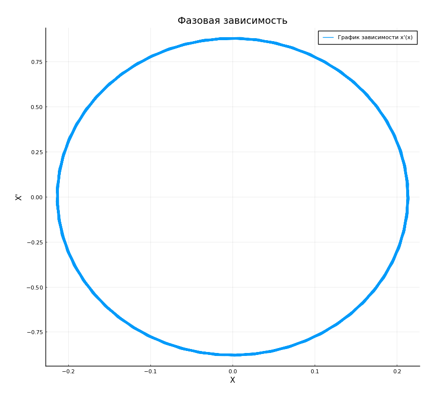
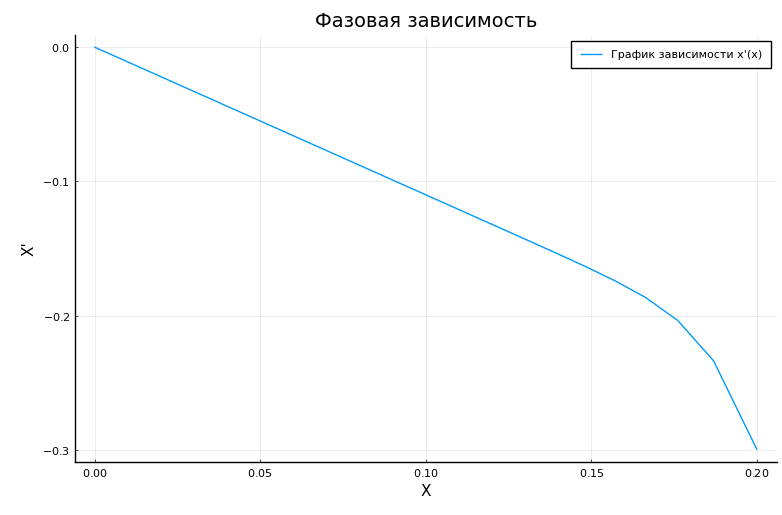
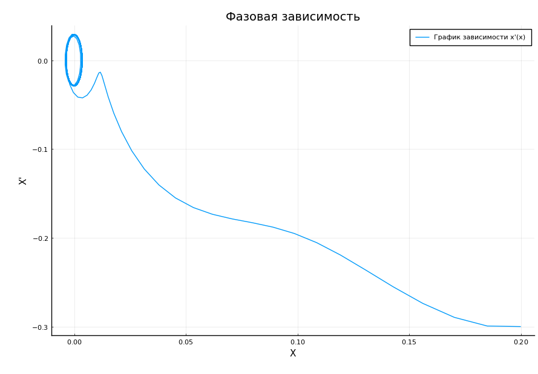

---
## Front matter
lang: ru-RU
title: Защита лабораторной работы № 4. Модель гармонических колебаний
author: Наливайко Сергей Максимович
institute: RUDN University, Moscow, Russian Federation
date: 11 March, 2021

## Formatting
toc: false
slide_level: 2
theme: metropolis
header-includes: 
 - \metroset{progressbar=frametitle,sectionpage=progressbar,numbering=fraction}
 - '\makeatletter'
 - '\beamer@ignorenonframefalse'
 - '\makeatother'
aspectratio: 43
section-titles: true
---

# Цель работы

## Цель работы

Научиться моделировать гармонические колебания.

# Формулировка задачи. Вариант 45

## Формулировка задачи

Постройте фазовый портрет гармонического осциллятора и решение уравнения
гармонического осциллятора для следующих случаев:

1. Колебания гармонического осциллятора без затуханий и без действий внешней силы $x''(t) + 17x = 0$,
2. Колебания гармонического осциллятора c затуханием и без действий внешней силы $x''(t) + 22x'(t) + 23x = 0$,
3. Колебания гармонического осциллятора c затуханием и под действием внешней силы $x''(t) + 5x'(t) + 8x = 0.25\sin{8t}$,

На интервале $t \in [0; 58]$ (шаг 0.05) с начальными условиями $x_0 = 0.2$, $y_0 = -0.3$.

# Решение задачи

## Решение задачи 1

$$x''(t) + 17x = 0$$

$$w^2_0 = 17, 2 * \gamma = 0,$$
$f(t)$ не определена

## Решение задачи 1

$$
      \begin{cases} 
      x'(t) = y \\ 
      y'(t) = - 17*x \\ 
      \end{cases}
$$

Интервал $t \in [0; 58]$ (шаг 0.05) с начальными условиями $x_0 = 0.2$, $y_0 = -0.3$.

## Решение задачи 1

{ width=70% }

## Решение задачи 2

$$x''(t) + 22x'(t) + 23x = 0$$

$$w^2_0 = 23, 2 * \gamma = 22 $$
$f(t)$ не определена

## Решение задачи 2

$$
      \begin{cases} 
      x'(t) = y \\ 
      y'(t) =  - 22 * y - 23*x \\ 
      \end{cases}
$$

Интервал $t \in [0; 58]$ (шаг 0.05) с начальными условиями $x_0 = 0.2$, $y_0 = -0.3$.

## Решение задачи 2

{ width=70% }

## Решение задачи 3

$$x''(t) + 5x'(t) + 8x = 0.25\sin{8t}$$

$$w^2_0 = 8, 2 * \gamma = 5 , f(t) = 0.25\sin{8t}$$.

## Решение задачи 3

$$
      \begin{cases} 
      x'(t) = y \\ 
      y'(t) = 0.25\sin{8t} - 5 * y - 8*x \\ 
      \end{cases}
$$

Интервал $t \in [0; 58]$ (шаг 0.05) с начальными условиями $x_0 = 0.2$, $y_0 = -0.3$.

## Решение задачи 3

{ width=70% }

# Вывод 

В ходе лабораторной работы мы научились моделировать гармонические колебания.