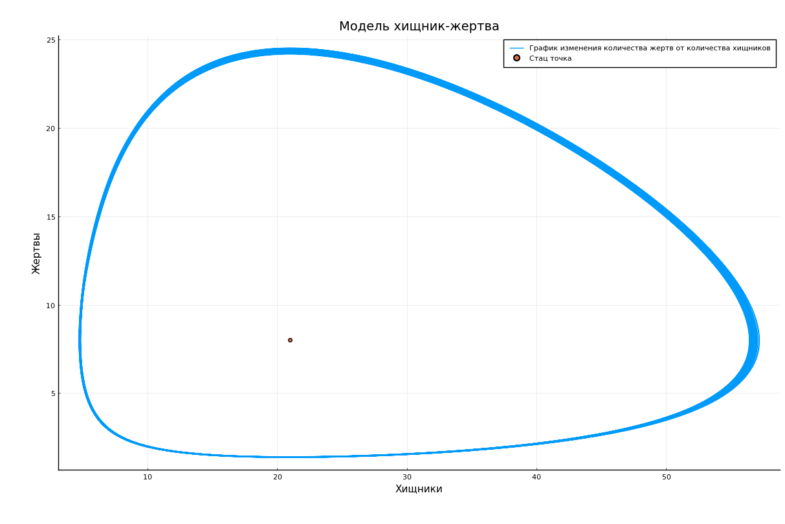

---
## Front matter
lang: ru-RU
title: Защита лабораторной работы № 5. Модель хищник-жертва
author: Наливайко Сергей Максимович
institute: RUDN University, Moscow, Russian Federation
date: 18 March, 2021

## Formatting
toc: false
slide_level: 2
theme: metropolis
header-includes: 
 - \metroset{progressbar=frametitle,sectionpage=progressbar,numbering=fraction}
 - '\makeatletter'
 - '\beamer@ignorenonframefalse'
 - '\makeatother'
aspectratio: 43
section-titles: true
---

# Цель работы

## Цель работы

Научиться моделировать простейшую модель взаимодействия двух видов типа «хищник — жертва» - модель Лотки-Вольтерры.

# Формулировка задачи. Вариант 45

## Формулировка задачи

Для модели «хищник-жертва»:

$$
\begin{cases} 
      \frac{\partial{x}}{\partial{t}} = -0.32y(t) + 0.04x(t)y(t) \\ 
      \frac{\partial{y}}{\partial{t}} = 0.42y(t) - 0.02x(t)y(t) \\ 
\end{cases}
$$

Постройте график зависимости численности хищников от численности жертв, а также графики изменения численности хищников и численности жертв при следующих начальных условиях: $x_0 = 9, y_0 = 20$. Найдите стационарное
состояние системы.

# Решение задачи

## Решение задачи 

{ width=70% }

## Решение задачи 

{  width=70% }

# Вывод 

В ходе лабораторной работы мы научились моделировать простейшую модель взаимодействия двух видов типа «хищник — жертва».