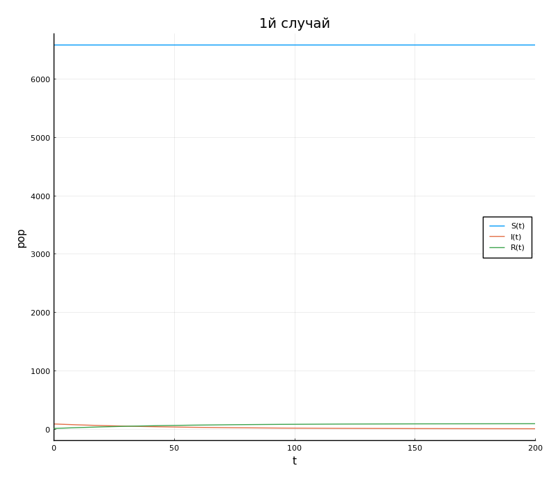
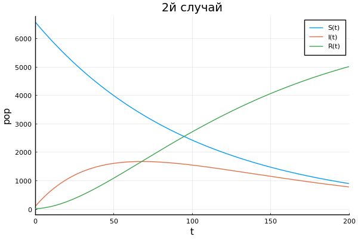

---
# Front matter
lang: ru-RU
title: "Отчет по лабораторной работе № 6. Задача об эпидемии"
subtitle: "дисциплина: Математическое моделирование"
author: "Наливайко Сергей Максимович"

# Formatting
toc-title: "Содержание"
toc: true # Table of contents
toc_depth: 2
lof: false # List of figures
lot: false # List of tables
fontsize: 12pt
linestretch: 1.5
papersize: a4paper
documentclass: scrreprt
polyglossia-lang: russian
polyglossia-otherlangs: english
mainfont: PT Serif
romanfont: PT Serif
sansfont: PT Sans
monofont: PT Mono
mainfontoptions: Ligatures=TeX
romanfontoptions: Ligatures=TeX
sansfontoptions: Ligatures=TeX,Scale=MatchLowercase
monofontoptions: Scale=MatchLowercase
indent: true
pdf-engine: lualatex
header-includes:
  - \linepenalty=10 # the penalty added to the badness of each line within a paragraph (no associated penalty node) Increasing the value makes tex try to have fewer lines in the paragraph.
  - \interlinepenalty=0 # value of the penalty (node) added after each line of a paragraph.
  - \hyphenpenalty=50 # the penalty for line breaking at an automatically inserted hyphen
  - \exhyphenpenalty=50 # the penalty for line breaking at an explicit hyphen
  - \binoppenalty=700 # the penalty for breaking a line at a binary operator
  - \relpenalty=500 # the penalty for breaking a line at a relation
  - \clubpenalty=150 # extra penalty for breaking after first line of a paragraph
  - \widowpenalty=150 # extra penalty for breaking before last line of a paragraph
  - \displaywidowpenalty=50 # extra penalty for breaking before last line before a display math
  - \brokenpenalty=100 # extra penalty for page breaking after a hyphenated line
  - \predisplaypenalty=10000 # penalty for breaking before a display
  - \postdisplaypenalty=0 # penalty for breaking after a display
  - \floatingpenalty = 20000 # penalty for splitting an insertion (can only be split footnote in standard LaTeX)
  - \raggedbottom # or \flushbottom
  - \usepackage{float} # keep figures where there are in the text
  - \floatplacement{figure}{H} # keep figures where there are in the text
---

# Цель работы

Научиться моделировать простейшую модель эпидемии.

# Выполнение лабораторной работы

## Краткая теоретическая справка

Рассмотрим простейшую модель эпидемии. Предположим, что некая популяция, состоящая из $N$ особей, подразделяется на три группы. Первая группа - это восприимчивые к болезни, но пока здоровые особи, обозначим их через $S(t)$. Вторая группа – это число инфицированных особей, которые также при этом являются распространителями инфекции, обозначим их $I(t)$. А третья группа, обозначающаяся через $R(t)$ – это
здоровые особи с иммунитетом к болезни.

До того, как число заболевших не превышает критического значения $I^*$, считаем, что все больные изолированы и не заражают здоровых. Когда $I(t) > I^*$, тогда инфицирование способны заражать восприимчивых к болезни особей.


Таким образом, скорость изменения числа $S(t)$ меняется по следующему закону:

$$
\frac{\partial{S}}{\partial{t}} = 
    \begin{cases} 
      -\alpha S, \ I(t) > I^* \\ 
      0, \ I(t) \leq I^* \\ 
    \end{cases}
$$

$$
\frac{\partial{I}}{\partial{t}} = 
    \begin{cases} 
      -\alpha S - \beta I, \ I(t) > I^* \\ 
      -\beta I, \ I(t) \leq I^* \\ 
    \end{cases}
$$

$$
\frac{\partial{R}}{\partial{t}} = \beta I.
$$

Постоянные пропорциональности $\alpha$ , $\beta$- это коэффициенты заболеваемости и выздоровления соответственно.


## Формулировка задачи. Вариант 45

На одном острове вспыхнула эпидемия. Известно, что из всех проживающих на острове ($N=6 666$) в момент начала эпидемии ($t=0$) число заболевших людей (являющихся распространителями инфекции) $I(0)=83$, А число здоровых людей с иммунитетом к болезни $R(0)=6$. Таким образом, число людей восприимчивых к
болезни, но пока здоровых, в начальный момент времени $S(0)=N-I(0)- R(0)$.

Постройте графики изменения числа особей в каждой из трех групп. Рассмотрите, как будет протекать эпидемия в случае:


1. Если $I(0) \leq I^*$;
   
2. Если $I(0) > I^*$.

## Решение задачи

Пусть $\alpha = 0.01, \ \beta = 0.02$. Нам известны параметры:

$$
N = 6666, \ t = 0, \ I(0) = 83, \ R(0) = 6, \ S(0) = N - I(0) - R(0).
$$

1. Составим систему ДУ:

$$
  \begin{cases} 
    \frac{\partial{S}}{\partial{t}} = 0 \\ 
    \frac{\partial{I}}{\partial{t}} = -\beta I \\
    \frac{\partial{R}}{\partial{t}} = \beta I.
    \end{cases}
$$

Напишем программный код для первого случая. Получим график для второго случая (рис. -@fig:001). 

  ```
  using Plots 
  using DifferentialEquations
  pyplot();

  N = 6666;
  a = 0.01;
  b = 0.02;
  I0 = 83;
  R0 = 6;
  S0 = N - I0 - R0;
  t = (0, 200);
  p = [a,b];
  x0 = [S0, I0, R0];
  step = 0.01;

  function syst1(dx, x, p, t)
        a, b = p;
        dx[1] = 0;
        dx[2] = -b * x[2];
        dx[3] = b * x[2];
  end

  prob = ODEProblem(syst1, x0, t, p);
  sol = solve(prob, saveat = step);
  plot(sol, xlabel = "t", ylabel = "population", labels = ["S(t)" "I(t)" "R(t)"])
  title!("1й случай")
  ```

  { #fig:001 width=70% }


2. Составим систему ДУ:

$$
  \begin{cases} 
    \frac{\partial{S}}{\partial{t}} = -\alpha S \\ 
    \frac{\partial{I}}{\partial{t}} = -\alpha S - \beta I \\
    \frac{\partial{R}}{\partial{t}} = \beta I.
    \end{cases}
$$

Напишем программный код для второго случая. Получим график для первого случая (рис. -@fig:002). 

  ```
  using Plots 
  using DifferentialEquations
  pyplot();

  N = 6666;
  a = 0.01;
  b = 0.02;
  I0 = 83;
  R0 = 6;
  S0 = N - I0 - R0;
  t = (0, 200);
  p = [a,b];
  x0 = [S0, I0, R0];
  step = 0.01;

  function syst1(dx, x, p, t)
        a, b = p;
        dx[1] = -a * x[1];
        dx[2] = a * x[1] - b * x[2];
        dx[3] = b * x[2];
  end

  prob = ODEProblem(syst1, x0, t, p);
  sol = solve(prob, saveat = step);
  plot(sol, xlabel = "t", ylabel = "population", labels = ["S(t)" "I(t)" "R(t)"])
  title!("2й случай")
  ```

  { #fig:002 width=70% }

# Вывод

В ходе лабораторной работы мы научились моделировать простейшую модель эпидемии.