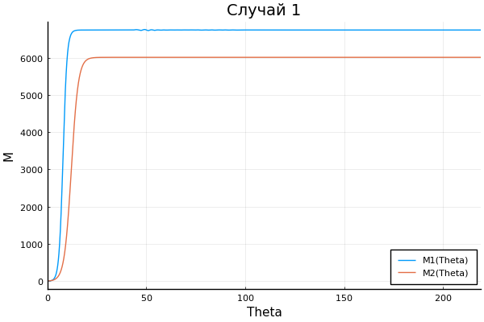
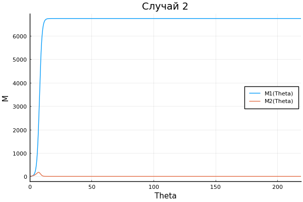

---
# Front matter
lang: ru-RU
title: "Отчет по лабораторной работе № 8. Модель конкуренции двух фирм"
subtitle: "дисциплина: Математическое моделирование"
author: "Наливайко Сергей Максимович"

# Formatting
toc-title: "Содержание"
toc: true # Table of contents
toc_depth: 2
lof: false # List of figures
lot: false # List of tables
fontsize: 12pt
linestretch: 1.5
papersize: a4paper
documentclass: scrreprt
polyglossia-lang: russian
polyglossia-otherlangs: english
mainfont: PT Serif
romanfont: PT Serif
sansfont: PT Sans
monofont: PT Mono
mainfontoptions: Ligatures=TeX
romanfontoptions: Ligatures=TeX
sansfontoptions: Ligatures=TeX,Scale=MatchLowercase
monofontoptions: Scale=MatchLowercase
indent: true
pdf-engine: lualatex
header-includes:
  - \linepenalty=10 # the penalty added to the badness of each line within a paragraph (no associated penalty node) Increasing the value makes tex try to have fewer lines in the paragraph.
  - \interlinepenalty=0 # value of the penalty (node) added after each line of a paragraph.
  - \hyphenpenalty=50 # the penalty for line breaking at an automatically inserted hyphen
  - \exhyphenpenalty=50 # the penalty for line breaking at an explicit hyphen
  - \binoppenalty=700 # the penalty for breaking a line at a binary operator
  - \relpenalty=500 # the penalty for breaking a line at a relation
  - \clubpenalty=150 # extra penalty for breaking after first line of a paragraph
  - \widowpenalty=150 # extra penalty for breaking before last line of a paragraph
  - \displaywidowpenalty=50 # extra penalty for breaking before last line before a display math
  - \brokenpenalty=100 # extra penalty for page breaking after a hyphenated line
  - \predisplaypenalty=10000 # penalty for breaking before a display
  - \postdisplaypenalty=0 # penalty for breaking after a display
  - \floatingpenalty = 20000 # penalty for splitting an insertion (can only be split footnote in standard LaTeX)
  - \raggedbottom # or \flushbottom
  - \usepackage{float} # keep figures where there are in the text
  - \floatplacement{figure}{H} # keep figures where there are in the text
---

# Цель работы

$\quad$Научиться моделировать модель конкуренции двух фирм. 

# Выполнение лабораторной работы

## Краткая теоретическая справка

$\quad$В 1м случае, на рынке устанавливается единая цена, которая определяется
балансом суммарного предложения и спроса. Иными словами, в рамках нашей
модели конкурентная борьба ведётся только рыночными методами. То есть,
конкуренты могут влиять на противника путем изменения параметров своего
производства: себестоимость, время цикла, но не могут прямо вмешиваться в
ситуацию на рынке («назначать» цену или влиять на потребителей каким-
либо иным способом.)

$$
  \begin{cases} 
  \ \frac{\partial{M_1}}{\partial{\theta}} \ = \ M_1 - \frac{b}{c_1}M_1*M_2 - \frac{a_1}{c_1}*M_1^2 \\
  \ \frac{\partial{M_2}}{\partial{\theta}} \ = \ \frac{c_2}{c_1}M_2 - \frac{b}{c_1}M_1*M_2 - \frac{a_2}{c_1}*M_2^2 \\
  \end{cases}
$$

где $\theta = \frac{t}{c_1}$.

$\quad$Для 2-го случая помимо экономического фактора влияния
(изменение себестоимости, производственного цикла, использование кредита и
т.п.), используются еще и социально-психологические факторы – формирование
общественного предпочтения одного товара другому, не зависимо от их качества и
цены. В этом случае взаимодействие двух фирм будет зависеть друг от друга,
соответственно коэффициент перед $M_1$ $M_2$ будет отличаться. Тогда имеем 

$$
  \begin{cases} 
  \ \frac{\partial{M_1}}{\partial{\theta}} \ = \ M_1 - (\frac{b}{c_1} + K)M_1*M_2 - \frac{a_1}{c_1}*M_1^2 \\
  \ \frac{\partial{M_2}}{\partial{\theta}} \ = \ \frac{c_2}{c_1}M_2 - (\frac{b}{c_1} + L)M_1*M_2 - \frac{a_2}{c_1}*M_2^2 \\
  \end{cases}
$$

где $\theta = \frac{t}{c_1}$ и $K$, $L$ - соответствующие коэффициенты социально-психологического фактора.

$\quad$Для 2х случаев соответствующие коэффициенты:

$$a_1 = \frac{p_{cr}}{\tau_1^2 p_1^2Nq}, \ a_2 = \frac{p_{cr}}{\tau_2^2 p_2^2Nq}, \ b = \frac{p_{cr}}{\tau_1^2p_1^2\tau_2^2p^2_2Nq} \ c_1 = \frac{p_{cr}-p_1}{\tau_1p_1}, c_2 = \frac{p_{cr}-p_2}{\tau_2p_2} $$

**Обозначения:**

$N$ - число потребителей производимого продукта.

$\tau$ - длительность производственного цикла.

$p_{cr}$ -  рыночная цена товара.

$p$ - себестоимость продукта, то есть переменные издержки на производство единицы продукции.

$q$ - максимальная потребность одного человека в продукте в единицу времени.

$\theta = \frac{t}{c_1}$ - безразмерное время.

## Формулировка задачи. Вариант 45


**Случай 1.** 

$$
  \begin{cases} 
  \ \frac{\partial{M_1}}{\partial{\theta}} \ = \ M_1 - \frac{b}{c_1}M_1*M_2 - \frac{a_1}{c_1}*M_1^2 \\
  \ \frac{\partial{M_2}}{\partial{\theta}} \ = \ \frac{c_2}{c_1}M_2 - \frac{b}{c_1}M_1*M_2 - \frac{a_2}{c_1}*M_2^2 \\
  \end{cases}
$$

$$a_1 = \frac{p_{cr}}{\tau_1^2 p_1^2Nq}, \ a_2 = \frac{p_{cr}}{\tau_2^2 p_2^2Nq}, \ b = \frac{p_{cr}}{\tau_1^2p_1^2\tau_2^2p^2_2Nq} \ c_1 = \frac{p_{cr}-p_1}{\tau_1p_1}, c_2 = \frac{p_{cr}-p_2}{\tau_2p_2} $$


**Случай 2.** 


$$
  \begin{cases} 
  \ \frac{\partial{M_1}}{\partial{\theta}} \ = \ M_1 - \frac{b}{c_1}M_1*M_2 - \frac{a_1}{c_1}*M_1^2 \\
  \ \frac{\partial{M_2}}{\partial{\theta}} \ = \ \frac{c_2}{c_1}M_2 - (\frac{b}{c_1} + 0.00026)M_1*M_2 - \frac{a_2}{c_1}*M_2^2 \\
  \end{cases}
$$

$$a_1 = \frac{p_{cr}}{\tau_1^2 p_1^2Nq}, \ a_2 = \frac{p_{cr}}{\tau_2^2 p_2^2Nq}, \ b = \frac{p_{cr}}{\tau_1^2p_1^2\tau_2^2p^2_2Nq} \ c_1 = \frac{p_{cr}-p_1}{\tau_1p_1}, c_2 = \frac{p_{cr}-p_2}{\tau_2p_2} $$


Соответствующие коэффициенты для обоих случаев: 

$$M^1_0 = 2.6, M_0^2 = 6.2$$
$$p_{cr}=40, N=43, q=1$$
$$\tau_1 = 20, \tau_2 = 14$$
$$p_1 = 10.7, p_2 = 19.1$$

## Решение задачи

1. Напишем программный код для 1-го случая и посмотрим на график (рис. -@fig:001).
  
  { #fig:001 width=70% }

```
using DifferentialEquations
using Plots
pyplot()

x0 = [2.6, 6.2];
t = (0.0, 30.0);
p_cr = 40;
N  = 43;
q = 1;
tau_1 = 20;
tau_2  = 14;
p_1 = 10.7;
p_2 = 19.1;

a1 = (p_cr) / (tau_1 * tau_1 * p_1 * p_1 * N * q);
a2 = (p_cr) / (tau_2 * tau_2 * p_2 * p_2 * N * q);
b = (p_cr) / (tau_1 * tau_1 * p_1 * p_1 * tau_2 * tau_2 * p_2 * p_2 * N * q);
c1 = (p_cr - p_1) / (tau_1 * p_1);
c2 = (p_cr - p_2) / (tau_2 * p_2);
theta = t./c1;
step = 0.01 / c1;

function syst(dx, x, p, t)
       a1,a2,b,c1,c2 = p;
       dx[1] = x[1] - b/c1 * x[1]*x[2] - a1/c1 * x[1]*x[1];
       dx[2] = c2/c1 * x[2] - b/c1 * x[1]*x[2] - a2/c1 * x[2]*x[2];
end

p = [a1, a2, b, c1,c2];

prob = ODEProblem(syst, x0, theta, p);
sol = solve(prob, saveat = step);
plot(sol, xlabel = "Theta", ylabel = "M", labels = ["M1(Theta)" "M2(Theta)"])
title!("Случай 1")
```

2. Напишем программный код для 1-го случая и посмотрим на график (рис. -@fig:002).
  
  { #fig:002 width=70% }

```
using DifferentialEquations
using Plots
pyplot()

x0 = [2.6, 6.2];
t = (0.0, 30.0);
p_cr = 40;
N  = 43;
q = 1;
tau_1 = 20;
tau_2  = 14;
p_1 = 10.7;
p_2 = 19.1;

a1 = (p_cr) / (tau_1 * tau_1 * p_1 * p_1 * N * q);
a2 = (p_cr) / (tau_2 * tau_2 * p_2 * p_2 * N * q);
b = (p_cr) / (tau_1 * tau_1 * p_1 * p_1 * tau_2 * tau_2 * p_2 * p_2 * N * q);
c1 = (p_cr - p_1) / (tau_1 * p_1);
c2 = (p_cr - p_2) / (tau_2 * p_2);
theta = t./c1;
step = 0.01 / c1;


function syst_2(dx, x, p, t)
       a1,a2,b,c1,c2 = p;
       dx[1] = x[1] - b/c1 * x[1]*x[2] - a1/c1 * x[1]*x[1];
       dx[2] = c2/c1 * x[2] - (b/c1 + 0.00026) * x[1]*x[2] - a2/c1 * x[2]*x[2];
end

prob = ODEProblem(syst_2, x0, theta, p);
sol = solve(prob, saveat = step);
plot(sol)
plot(sol, xlabel = "Theta", ylabel = "M", labels = ["M1(Theta)" "M2(Theta)"])
title!("Случай 2")
```

# Вывод

$\quad$В ходе лабораторной работы мы научились моделировать модель конкуренции двух фирм. 